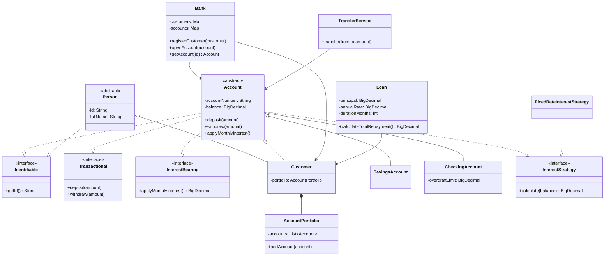

# UML (Class Diagram)

```mermaid
classDiagram
    class Identifiable {
      <<interface>>
      +getId() String
    }

    class Transactional {
      <<interface>>
      +deposit(amount)
      +withdraw(amount)
    }

    class InterestBearing {
      <<interface>>
      +applyMonthlyInterest() BigDecimal
    }

    class Person {
      <<abstract>>
      -id: String
      -fullName: String
    }

    class Customer {
      -portfolio: AccountPortfolio
    }

    class AccountPortfolio {
      -accounts: List~Account~
      +addAccount(account)
    }

    class Account {
      <<abstract>>
      -accountNumber: String
      -balance: BigDecimal
      +deposit(amount)
      +withdraw(amount)
      +applyMonthlyInterest()
    }

    class SavingsAccount
    class CheckingAccount {
      -overdraftLimit: BigDecimal
    }

    class Loan {
      -principal: BigDecimal
      -annualRate: BigDecimal
      -durationMonths: int
      +calculateTotalRepayment() BigDecimal
    }

    class Bank {
      -customers: Map
      -accounts: Map
      +registerCustomer(customer)
      +openAccount(account)
      +getAccount(id) Account
    }

    class TransferService {
      +transfer(from,to,amount)
    }

    class InterestStrategy {
      <<interface>>
      +calculate(balance) BigDecimal
    }

    class FixedRateInterestStrategy

    Person <|-- Customer
    Account <|-- SavingsAccount
    Account <|-- CheckingAccount
    Customer *-- AccountPortfolio
    Account o-- Customer
    Account ..|> Identifiable
    Account ..|> Transactional
    Account ..|> InterestBearing
    Person ..|> Identifiable
    Account ..> InterestStrategy
    FixedRateInterestStrategy ..|> InterestStrategy
    Bank --> Customer
    Bank --> Account
    TransferService --> Account
    Loan --> Customer
```
